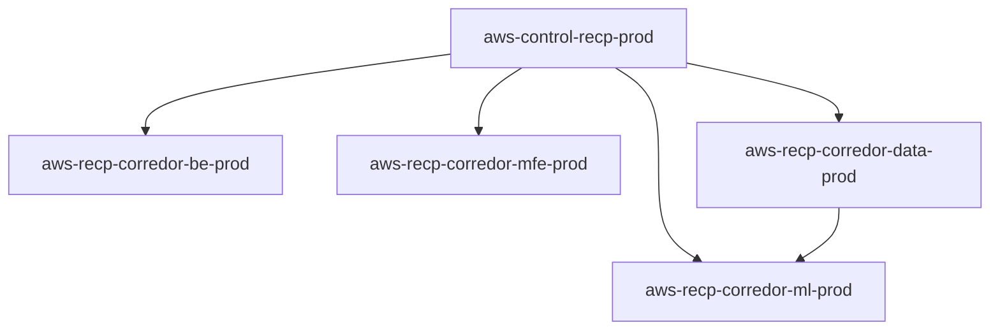

# Terraform Cloud Workspace Strategy

|                  |                                                                                                                                                                                         |
| ---------------- | --------------------------------------------------------------------------------------------------------------------------------------------------------------------------------------- |
| **Audience**     | Platform, application, data, and ML engineers using Terraform Cloud / HCP Terraform. Architects designing org-wide workspace layouts. Engineering leads owning infrastructure strategy. |
| **Scope**        | Workspace boundaries, repo layout, and the operational primitives that connect workspaces (Projects, outputs, triggers, agents, policy).                                                |
| **Out of scope** | Module design, resource naming conventions, AWS account strategy, CI/CD pipeline design.                                                                                                |

Workspace strategy is one of the highest-leverage decisions you make with TFC. Get it right and the platform scales smoothly as teams and services multiply. Get it wrong and you pay for years in lock contention, blast-radius blur, permission collapse, and geological refactors. This guide is the procedure, the signals, and the worked examples to get it right the first time — and the migration path back if you didn't.

> **Reader assumption:** you know what Terraform is, what TFC does, and roughly what a workspace contains. You may not have designed an org-wide layout before — that's what this doc is for.

---

## 1. TL;DR

### The answer in one sentence

> **Split Terraform Cloud workspaces by _lifecycle_ and _ownership_ — one foundation/control workspace plus one workspace per functional domain (backend, frontend, data, ML).** Not one giant workspace per environment.

### The mental model

A TFC workspace is **five things at once**, not one:

| Property                | What it actually is                                                         | Why it forces a split when it diverges                                            |
| ----------------------- | --------------------------------------------------------------------------- | --------------------------------------------------------------------------------- |
| **State file**          | One Terraform state, one drift report, one place all resources are tracked. | Two domains with different change rates pollute each other's drift and refactors. |
| **Blast radius**        | A single bad apply destroys _everything_ in the state.                      | Catastrophic-radius and routine-radius changes should not share an apply.         |
| **Run queue**           | TFC serializes runs per workspace. One in-flight plan blocks every other.   | A slow team's plan blocks every faster team's release cadence.                    |
| **Permission boundary** | Read / plan / apply permissions are scoped to the workspace.                | You cannot grant scoped access without leaking access to the other team's state.  |
| **Audit lens**          | Runs, approvals, changes, and policy results are filtered by this unit.     | Compliance scope (PCI, HIPAA, SOC2) must be auditable in isolation.               |

> **The rule:**
> Keep things in one workspace when **all five** properties align across them.
> Split the moment **any one** of them diverges.
> Every other guideline in this document is a corollary.

### Two reading modes

This doc is structured for either fast lookup or deep design work. Pick the row matching why you opened it.

| You need to...                               | Read...                                                                                                                                                | Time        |
| -------------------------------------------- | ------------------------------------------------------------------------------------------------------------------------------------------------------ | ----------- |
| Decide right now for a specific situation    | [§2 decision matrix](#2-the-decision-matrix) — match your row, follow the recommendation.                                                              | ~3 minutes  |
| Diagnose the pain in an existing setup       | [§3 symptoms](#3-symptoms-of-getting-it-wrong) — each symptom has a concrete detection cue you can check today.                                        | ~5 minutes  |
| Design an org-wide layout from scratch       | [§4 framework](#4-decision-framework) → [§5 reference architecture](#5-reference-architecture) → [§6 operational mechanics](#6-operational-mechanics). | ~30 minutes |
| Fix an existing God Workspace                | [§3](#3-symptoms-of-getting-it-wrong) to confirm the diagnosis, then [§9 migration](#9-migration-fixing-an-existing-god-workspace) for the procedure.  | ~20 minutes |
| Defend a workspace decision in design review | [§4 tie-breakers](#tie-breakers-when-signals-conflict) and [§8 anti-patterns](#8-anti-patterns) — both give you shared vocabulary.                     | ~10 minutes |
| Back a claim with an authoritative source    | [§10 references](#10-references) — official HashiCorp, AWS, and industry sources, each annotated with which section it informs.                        | reference   |

### When one workspace per env IS the right answer

**Small team, < 100 resources, single AWS account, no compliance scope, no third-party providers, plan time under ~5 minutes: keep one workspace per env.** The plumbing cost of splitting (`tfe_outputs` wiring, variable sets, OIDC roles, bootstrap ordering, agent pools) exceeds the operational cost at this scale. Plan the first split — foundation vs workloads — the moment you cross any of those thresholds. Don't wait until two or three are crossed; the refactor cost is much higher then ([§3](#3-symptoms-of-getting-it-wrong) #7).

---

## 2. The decision matrix

Find your situation in the first column, read the recommendation in the second, and use the third to understand _why_ and what to do first. The matrix covers the 80% case; anything outside it, run the [§4](#4-decision-framework) procedure.

| If you see this signal...                                                  | Then...                                                                              | Reasoning & first step                                                                                                                                                                                                                                |
| -------------------------------------------------------------------------- | ------------------------------------------------------------------------------------ | ----------------------------------------------------------------------------------------------------------------------------------------------------------------------------------------------------------------------------------------------------- |
| Single small team, < 100 resources, one AWS account, no compliance scope   | **Keep one workspace per env.** Don't over-engineer.                                 | The plumbing cost of splitting (`tfe_outputs`, variable sets, OIDC roles, bootstrap ordering) exceeds the operational cost at this scale. Revisit when you cross ~100 resources, add a second team, or onboard a non-AWS provider.                    |
| Two or more teams need write access to the same state                      | **Split by team ownership.**                                                         | The **permission boundary** property ([§1](#1-tldr)) diverges. Each team gets a workspace; cross-team data flows via `tfe_outputs`. Start with the team that's currently most blocked by lock contention.                                             |
| Foundation rarely changes; workloads (backend, data, ML) ship frequently   | **Split foundation from workload workspaces.**                                       | Run queue and cadence diverge. Extract foundation first — it has the lowest inbound-dependency count and the highest blast radius if a workload's bad apply touches it. Sequencing detail in [§9](#9-migration-fixing-an-existing-god-workspace).     |
| Plan time exceeds 10 minutes                                               | **Split now.** You're already paying.                                                | The tax is paid on every commit, and reviewers start rubber-stamping (see [§3](#3-symptoms-of-getting-it-wrong) #2). Before splitting, check whether the cause is module bloat or excess providers — sometimes a refactor buys a quarter.             |
| State exceeds ~150 resources                                               | **Plan a split.**                                                                    | Empirical cliff: drift reports, plan time, and review fatigue all degrade together past this point. Run [§4](#4-decision-framework)'s 5-step procedure on the largest grouping in the state; the natural seam is usually a functional layer.          |
| Resources mix AWS with Snowflake / Datadog / Cloudflare / Okta providers   | **Split by provider toolchain.**                                                     | Every declared provider initializes on every plan, slowing operations and broadening the workspace's OIDC token attack surface. Group providers from related domains (data; monitoring; networking) — aim for ≤2 non-trivial providers per workspace. |
| Some resources are PCI/HIPAA-scoped, others aren't                         | **Split by compliance scope.**                                                       | The **audit lens** is asymmetric — one PCI resource pulls the entire workspace into scope. Move _all_ in-scope resources to a dedicated workspace so the auditor reads only that one. Plan for ≥3 scoped resources to justify the workspace.          |
| Resources live in different AWS accounts                                   | **One workspace per (env × account × stack).**                                       | OIDC roles are account-scoped in practice. A single workspace token with cross-account reach defeats the entire purpose of the multi-account model.                                                                                                   |
| Destroying resource A would be catastrophic; destroying resource B is fine | **Split by blast radius.**                                                           | The "3 AM test" ([§3](#3-symptoms-of-getting-it-wrong) #3) failed. Move catastrophic-radius resources to a workspace with stricter approval policies and a slower cadence. Stateful resources (RDS, Redshift, DynamoDB with data) are the usual flag. |
| You're spinning up many similar microservices                              | **One `be` workspace, many module instances.** Don't create a workspace per service. | 30 services × 30 workspaces = 30× variable sets, OIDC roles, agent pools, and run histories — unbearable overhead. Use one workspace with `for_each` over a service module; same per-service isolation, none of the operational cost.                 |
| You inherited a God Workspace and runs are painful                         | **Plan a migration.**                                                                | Don't fix in place under load. Budget 1–2 weeks for a ~600-resource extraction. Start with the lowest-inbound-deps layer (usually network/foundation). Full sequencing template in [§9](#9-migration-fixing-an-existing-god-workspace).               |

> **Rule of thumb:** if you can't point to a specific row in this matrix that justifies a workspace, you don't need that workspace. Splits cost plumbing — earn each one.
>
> If your situation matches **two or more rows** simultaneously, run the [§4](#4-decision-framework) procedure to sequence the splits. Compliance scope always wins. Plan-time defers a quarter while you investigate root cause. Everything else is per-case.

---

## 3. Symptoms of getting it wrong

When workspace boundaries don't match the five properties from [§1](#1-tldr), the pain arrives one symptom at a time — each one too small to act on alone, together fatal to delivery throughput. Below are the seven recurring ones, in roughly the order they appear, each with a concrete way to detect it in your own environment before it compounds.

1. **Lock contention.** TFC serializes runs per workspace. When two teams share one, a 20-minute plan from team A queues every other team's runs behind it. Throughput drops linearly with team count.

   - _Detect:_ watch the TFC run queue. If pending runs from people other than the active applier are sitting there during business hours, you're already contending. The Slack-channel version: someone types "is anyone running TF on prod right now?" before pushing.

2. **Slow plans.** Plan time scales roughly linearly with state size. Below ~30 seconds, plans feel free; above 2 minutes, reviewers skim; above 10 minutes, they rubber-stamp the apply because waiting is unbearable. The cost is paid on every single commit.

   - _Detect:_ track plan time over 30 days. A creeping curve from 1 min to 6 min across a quarter is the leading indicator — at the same growth rate, that workspace becomes unusable within the next quarter.

3. **Blast-radius blur.** Terraform's dependency graph spans the whole state. A change to an S3 bucket policy can plan changes to a VPC. Engineers respond by either freezing the workspace (slow) or rubber-stamping plans without reading them (dangerous).

   - _Detect:_ the **3 AM test** — at 3 AM, fixing a routine bug here, what else could you accidentally destroy? If the answer scares you, the radius is too blurred. A softer signal: PR descriptions start including phrases like "ignore the network changes, those are unrelated."

4. **Permission collapse.** TFC permissions are workspace-scoped. To grant data engineers write access on their Snowflake config, you grant them write access on the VPC state. Least privilege is gone, and audit evidence becomes impossible to compile.

   - _Detect:_ list the workspace's admins. If they span more than one functional team, you've collapsed. The auditor's question: can you produce a per-team access log scoped to _their_ resources? If no, the boundary failed.

5. **Provider sprawl.** Every provider declared anywhere in the workspace initializes on every plan. AWS + Snowflake + Cloudflare + Datadog + Okta + GitHub + PagerDuty in one `.terraform/` slows every operation and broadens the supply-chain attack surface for the workspace's OIDC token.

   - _Detect:_ run `terraform providers`. More than 2–3 non-trivial providers from different domains (data vs. frontend vs. monitoring) is the smell. A faster proxy: plan startup time > 20 seconds before the first `Refreshing state` line appears.

6. **Drift becomes noise.** A drift report on 1,200 resources is unreadable; even at 200, it gets TL;DR'd in standups. Engineers stop opening it. Real drift — the thing you actually need to see — hides in the volume.

   - _Detect:_ does anyone open the weekly drift report? If the habitual reaction is "skip the drift summary, it's always the same dozen IAM policy auto-rotations," the signal-to-noise is too low and the workspace is too broad.

7. **Refactoring becomes geological.** "We'll split it later" means `state mv`, `moved` blocks, `removed` blocks, and import dances — multiplied by however many resources you've accumulated since you said that. Delay compounds: every new resource added to the wrong workspace is a future migration line item.
   - _Detect:_ nobody volunteers to touch the workspace's structure. PRs that propose moving a resource get reflexively blocked with "too risky right now." The workspace has entered **frozen mode** — it works but no one will refactor it. Terminal without an explicit migration project (see [§9](#9-migration-fixing-an-existing-god-workspace)).

> **Pattern recognition:** if you can name two or more of these in your current environment, you're past "monitor and revisit" — you're in territory where the next quarter will measurably hurt delivery. Run the [§4](#4-decision-framework) framework on the worst-offending workspace this week.

---

## 4. Decision framework

The mental model in §1 tells you _why_ to split. This section is the _how_ — the procedure to apply when facing a concrete "split or not" question, the signals with their detection cues, three worked examples a Senior CSA gets asked in practice, the tie-breakers when signals conflict, and the hard cases the framework doesn't cleanly resolve.

### Split signals — what to look for

Each row is a _single_ signal that justifies a split. One is enough — the five-properties rule is asymmetric.

| Signal                                    | Why it forces a split                                                                                                                                                                                                | What to actually look for                                                                                                                                                     |
| ----------------------------------------- | -------------------------------------------------------------------------------------------------------------------------------------------------------------------------------------------------------------------- | ----------------------------------------------------------------------------------------------------------------------------------------------------------------------------- |
| **Different deploy cadence**              | TFC serializes runs per workspace. A daily-cadence team queueing behind a monthly-cadence team is a recurring tax that compounds linearly with team count.                                                           | If you can't state both teams' deploy rhythms in one sentence ("foundation: monthly, backend: daily"), the cadences diverge.                                                  |
| **Different team owns it**                | Ownership equals permission boundary. You can't grant team A scoped access to "their" resources if the workspace also holds team B's resources.                                                                      | If two CODEOWNERS lines would point to different teams for files inside the same workspace, the team boundary diverges.                                                       |
| **Different blast-radius tolerance**      | A catastrophic-radius and a routine-radius resource sharing one state means every routine apply carries the catastrophic risk. Engineers either freeze the workspace (slow) or stop reading plans (dangerous).       | The "3 AM test": if someone has to fix a routine bug at 3 AM here, what else could they accidentally destroy? If the answer scares you, blast radii diverge.                  |
| **Different compliance scope**            | PCI / HIPAA / SOC 2 auditors need to read evidence in isolation. Mixed-scope workspaces force you to redact during audit, or worse, declare the whole workspace in scope.                                            | If the workspace contains _any_ resource subject to a compliance regime, ask: can the auditor evidence it without touching the other resources? If no, split.                 |
| **Different provider toolchain**          | Every provider declared in the workspace initializes on every plan. AWS + Snowflake + Cloudflare + Datadog in one `.terraform/` means slow plans and a broad attack surface for the workspace's OIDC token.          | Run `terraform providers`. More than ~2 non-trivial providers, especially across domains (data vs frontend), is the signal.                                                   |
| **Different AWS account**                 | Workspace OIDC roles are account-scoped in practice. Crossing accounts inside one workspace means a single token has cross-account reach — exactly what the multi-account model exists to prevent.                   | If the plan needs `assume_role` into more than one account, split.                                                                                                            |
| **Plan time > 10 min**                    | Compounding pain: long plans cause merge-queue backups, reviewers skim instead of reading, drift detection becomes unreviewable. The cost is paid every commit.                                                      | Measure, don't guess. If average `terraform plan` exceeds 10 min over the last 20 runs, you've passed the cliff.                                                              |
| **State > ~150 resources**                | Empirical: drift reports become unactionable, refactors require multi-day coordination, the dependency graph becomes opaque to the engineers maintaining it.                                                         | `terraform state list \| wc -l`. At 100 you start feeling it, at 150 you're past the inflection, at 300 you're triaging.                                                      |
| **Stateful vs stateless mixed**           | Stateless resources (ECS tasks, ALBs, Lambdas) can be destroyed and recreated safely. Stateful resources (RDS, DynamoDB with data, S3 with content) cannot. Mixing them means stateless changes carry stateful risk. | Look for `prevent_destroy = true` lifecycle blocks. If you've sprinkled them through a workspace to protect specific resources, those resources don't belong with the others. |
| **Cross-cutting "shared" infrastructure** | Resources consumed by ≥2 other workspaces (VPC, EKS, KMS keys, IAM baselines) belong in their producer's workspace — never duplicated, never owned by a consumer.                                                    | If two workspaces would each create a near-identical version of the same resource, neither owns it correctly. Promote it upstream and consume via `tfe_outputs`.              |

> **Note:** the 150-resource and 10-minute thresholds are empirical rules of thumb, not HashiCorp-published limits. Directionally right but team-specific — measure your own and adjust by ±30%.

### Keep-together signals — the over-splitting tax

Splits aren't free. Each one costs `tfe_outputs` wiring, more variable sets, a new agent pool, a new OIDC role, bootstrap ordering, and a new line in every on-call rotation. Don't split when:

| Signal                                           | Why keeping together is the right call                                                                                                                                                            | What to watch for                                                                                                              |
| ------------------------------------------------ | ------------------------------------------------------------------------------------------------------------------------------------------------------------------------------------------------- | ------------------------------------------------------------------------------------------------------------------------------ |
| **All five properties align**                    | Splitting adds plumbing with no operational benefit; you'll just manage two workspaces that always change together.                                                                               | If the workspaces would always appear in the same PR, you've split prematurely. Consolidate.                                   |
| **Tight coupling — A is meaningless without B**  | EKS cluster and node groups; ALB and target groups; Lambda and execution role. Atomic at the design level. Splitting creates orchestration bugs and lost atomicity.                               | If you'd need a `depends_on` from one workspace's resource to another's, that's a tight-coupling smell.                        |
| **Helper resources for a primary workload**      | The IAM role for an EKS cluster, the SG for an RDS, the log group for a Lambda. Exist only because the primary exists. Splitting them out adds plumbing for no isolation benefit.                 | Ask: "would I ever need this resource without the primary?" If no, it's a helper. Keep with the primary.                       |
| **The new workspace would own < 10 resources**   | Workspace overhead (Project assignment, variable sets, OIDC role, run history, drift monitoring) doesn't scale down. Below ~10 resources you pay the same fixed cost as a 200-resource workspace. | If you've already split and the new workspace is tiny, consolidate back to its nearest larger neighbour.                       |
| **Resources always change exclusively together** | Atomic-multi-workspace applies don't exist in TFC. If the workflow is "change A here, then change B in another workspace 5 minutes later," the boundary is in the wrong place.                    | A high ratio of "PRs that touch both workspaces" is the leading indicator. Audit your last 30 PRs.                             |
| **Under the small-org threshold**                | < 100 resources, one team, one account, no compliance scope: a single workspace per env is unequivocally cheaper to operate than a split.                                                         | If you're approaching the threshold (80–100 resources), plan the _first_ split (foundation vs workloads) before you cross 120. |

## 5. Reference architecture

This is the default layout. Adjust as your domain dictates, but justify deviations.

### Workspace layout

One **foundation/control workspace** plus one **workload workspace per functional domain**. Each row below is one workspace per environment — so dev/stage/prod multiplies the count by three.

| Workspace (prod example)      | Owns                                                                                                           | Cadence              | Owner         |
| ----------------------------- | -------------------------------------------------------------------------------------------------------------- | -------------------- | ------------- |
| `aws-control-recp-prod`       | Org policies, security configurations, IAM baselines, shared networking (VPCs, TGW, R53), Control Tower / SCPs | Quarterly to monthly | Platform      |
| `aws-recp-corredor-be-prod`   | Backend services — ECS/EKS apps, app IAM, queues, app secrets                                                  | Daily                | Backend team  |
| `aws-recp-corredor-mfe-prod`  | Frontend / edge — CloudFront, WAF, public Route53, edge functions                                              | Weekly               | Frontend team |
| `aws-recp-corredor-data-prod` | Data & analytics — S3 lake, Glue, Athena, Redshift, Lake Formation                                             | Weekly               | Data team     |
| `aws-recp-corredor-ml-prod`   | ML — SageMaker, training infra, model registry, GPU pools                                                      | High churn           | ML team       |

### Dependency graph



### Per-domain rationale

| Domain       | Owns                                                                                      | Why a dedicated workspace earns its keep                                                                            | Common mistake to avoid                                                                                                                        |
| ------------ | ----------------------------------------------------------------------------------------- | ------------------------------------------------------------------------------------------------------------------- | ---------------------------------------------------------------------------------------------------------------------------------------------- |
| **Services** | ECS/EKS services, app IAM, SQS, SNS, app secrets                                          | Daily ship cadence can't queue behind monthly network changes; permissions cleanly bounded per app team.            | Putting RDS in the `be` workspace — DB blast radius is much higher than service blast radius. Promote it to `data` or a per-domain data stack. |
| **Edge**     | CloudFront, Lambda@Edge, public R53, WAF, possibly Cloudflare/Fastly/Vercel               | Different rollback model (cache invalidation, traffic shifting — not destroy/recreate). Provider mix often non-AWS. | Folding CloudFront into `be` because "the app is one thing." It's not — edge has its own cadence and ops model.                                |
| **Data**     | Glue, Lake Formation, Redshift, Athena, EMR, MWAA, Snowflake                              | Lower velocity, stateful resources (destroying Redshift destroys data), separate budget, distinct toolchain.        | Mixing Lake Formation permissions with app IAM — different mental models, different audit cadence.                                             |
| **ML**       | SageMaker, Bedrock provisioned throughput, GPU EC2, model registry, feature store, MLflow | Very high churn (training spins up and down), expensive misclicks (GPUs), often separate IAM for train vs serve.    | Same workspace for training and inference. Inference is production; training is experimentation. Different blast radii.                        |

> **Multi-region.** Append `-<region>` (`use1`, `euw1`) when a stack is region-scoped — typical for `be` (per-region ALBs, ECS/EKS clusters) and `data` (per-region lakes, Redshift). The foundation control workspace usually stays region-agnostic; if shared networking starts needing per-region splits, that's exactly the signal to extract `aws-control-recp-network-<env>-<region>` out of the foundation.

---

## 6. Operational mechanics

Splitting creates two things to manage: how the workspaces are organized, and how data flows between them.

### TFC Projects

Group your workspaces per environment under a Project (`recp-dev`, `recp-stage`, `recp-prod`). Permissions, variable sets, and policy enforcement attach at the Project level — so you don't click through each workspace to add an OIDC role ARN.

### Variable Sets

Define shared variables (region, account ID, TFC org, common tags) once at the Project or org level. Per-workspace variables stay specific to that stack.

Avoid putting per-workspace secrets in shared variable sets — that defeats the permission boundary.

### Cross-workspace data flow: `tfe_outputs`

Workload workspaces consume foundation outputs — VPC and subnet IDs, baseline IAM role ARNs, shared cluster names, KMS keys. The `tfe_outputs` data source is the recommended way to read them:

```hcl
data "tfe_outputs" "foundation" {
  organization = var.tfc_org
  workspace    = "aws-control-recp-prod"
}

resource "aws_lb" "app" {
  subnets         = data.tfe_outputs.foundation.values.private_subnet_ids
  security_groups = [data.tfe_outputs.foundation.values.app_sg_id]
  # ...
}
```

> **Prefer `tfe_outputs` over the older `terraform_remote_state` data source.** It uses the TFC API directly, respects workspace permissions, and integrates with Project-level access controls.

### Run Triggers

Run triggers let an upstream apply (e.g., the foundation) auto-plan a downstream workspace. Useful during bootstrap; dangerous as a steady-state pattern. The default for cross-workspace dependencies is **lazy** — workloads pick up upstream changes on their next regular run via `tfe_outputs`. Eager triggers are an anti-pattern at steady state (see [§8.7](#anti-pattern-7-eager-run-trigger-cascades)).

Reserve run triggers for:

- Bootstrap sequences (initial environment stand-up, where the chain has to run in order)
- Critical-path infrastructure where staleness causes immediate failure (rare)

### Agent Pools

Give each workspace its own agent pool (or share one pool across closely related workloads) and bind its OIDC role to exactly the AWS IAM that workspace needs. The `data` pool gets Glue / Lake Formation / Redshift; `be` gets ECS task and app-secret permissions; `aws-control-recp-prod` gets the broad foundation IAM and nothing else gets close to it. Compromise of one pool doesn't grant the others.

This is the operational manifestation of the **permission boundary** property.

### Policy enforcement (Sentinel / OPA)

Policies attach at the org, Project, or workspace level. Per-Project policy sets let you enforce, e.g., that the `recp-prod` Project can't create resources outside an approved VPC CIDR or without required tags — without imposing the same rule on `recp-dev` experimentation.

### Bootstrap order

The first time you stand up an environment, the foundation workspace applies first; workload workspaces follow in any order (except `ml`, which depends on `data`). After bootstrap, workspaces are independent — they can re-plan in any order.

Document the bootstrap order in your management workspace README.

---

## 7. Repo strategy

Repos are a separate decision from workspaces. Don't conflate them.

| Model                                                              | When it works                                                         | When it doesn't                                                                                            |
| ------------------------------------------------------------------ | --------------------------------------------------------------------- | ---------------------------------------------------------------------------------------------------------- |
| **Monorepo + many workspaces** (TFC `working_directory` per stack) | Most orgs starting out, < 5 teams, want easy cross-cutting refactors. | When teams want hard CODEOWNERS boundaries or independent release cadence.                                 |
| **Multi-repo + many workspaces** (one repo per stack or team)      | Mature orgs with strong team ownership and independent CI/CD.         | Cross-cutting refactors require coordinated PRs across repos. Versioning shared modules becomes mandatory. |
| **Multi-repo + one workspace**                                     | **Never.** Breaks atomic apply for that workspace.                    | Always.                                                                                                    |
| **Monorepo + one workspace**                                       | Tiny single-team projects under ~100 resources.                       | Anything bigger.                                                                                           |

**Default recommendation:** monorepo with per-stack subdirectories, one TFC workspace per `(env × stack)`. Migrate to multi-repo when team boundaries clearly demand it — not before.

> **Why this default:** the cost of going monorepo → multi-repo is roughly linear (split out one stack at a time). The cost of going multi-repo → monorepo is much higher. Start in the cheaper-to-reverse direction.

---

## 8. Anti-patterns

Named so teams can call them out in design reviews.

### Anti-pattern 1: The God Workspace

"Let's put everything in one workspace for now."

There is no "for now." Splitting later costs `moved` blocks, `state mv` invocations, and weeks of coordination. The cost compounds with every resource added.

### Anti-pattern 2: Splitting by AWS service

`vpc-workspace`, `iam-workspace`, `s3-workspace`, `ec2-workspace`.

This splits by **technology**, not by **lifecycle and ownership**. Every change becomes cross-cutting: a new service needs IAM (workspace 1), an S3 bucket (workspace 2), an ECS task (workspace 3), and a security group (workspace 4). You've made every PR a four-way orchestration.

### Anti-pattern 3: One workspace per microservice

If 30 services share the same RDS + ECS + IAM pattern, that's **one workspace consuming a module 30 times**, not 30 workspaces.

A workspace per microservice creates 30× the variable sets, 30× the OIDC roles, 30× the run histories to monitor.

### Anti-pattern 4: Workspace per environment, monolithic

`dev`, `stage`, `prod` as three giant workspaces.

This is the God Workspace wearing a costume. All the problems of the God Workspace, with the added bonus that prod is a single point of failure for the entire estate.

### Anti-pattern 5: Splitting without an owner

Orphan workspaces with no on-call accumulate drift, expire credentials, and become security liabilities.

**Rule:** every workspace has exactly one owning team. If you can't name the owner, you can't create the workspace.

### Anti-pattern 6: Monolithic in dev, split in prod

"Dev is just a sandbox; we'll split when we get to prod."

This guarantees prod is the **first** place the boundary is tested. Backwards. Dev exists to mirror prod's topology — including workspace boundaries.

### Anti-pattern 7: Eager run-trigger cascades

Every workspace triggers every downstream workspace on every apply.

A small change in `aws-control-recp-prod` cascades through `aws-recp-corredor-be-prod`, `aws-recp-corredor-mfe-prod`, `aws-recp-corredor-data-prod`, `aws-recp-corredor-ml-prod` — four extra plans, four potential failures, none of which were intended. Reserve eager triggers for genuine bootstrap sequences.

---

## 9. Migration: fixing an existing God Workspace

If you already have a 600-resource monolith and runs are painful, here's the approach.

### Strategy

1. **Don't try to fix in place.** Plan the split as a project, with a real timeline. For a 600-resource state, budget 1–2 weeks of focused work.
2. **Split by clearest seam first.** Usually the foundation/network is the easiest to extract because it has the fewest inbound dependencies.
3. **Build the new workspace empty, then move resources in.** Use `removed` blocks in the old workspace and `import` blocks in the new one (Terraform 1.7+ for `removed`; 1.5+ for `import`). On older versions, fall back to `terraform state mv` and `terraform state rm` plus `terraform import`.
4. **Cut over one workspace at a time.** Don't try to split into all target workspaces at once.

### Tools and techniques

- **`moved` blocks** — for resource address changes within the same state file.
- **`removed` blocks** — to detach a resource from one workspace's state without destroying it (Terraform 1.7+).
- **`import` blocks** — to attach the detached resource to the new workspace's state (Terraform 1.5+).
- **`terraform state mv`** — older, imperative version. Still works but harder to review in a PR.
- **`tfe_outputs`** — once you've extracted a workspace, downstream workspaces consume its outputs via this data source.

### Sequencing template

For each workspace extraction:

1. Create the new workspace via the management workspace.
2. Copy the relevant code into the new stack directory.
3. Plan in the new workspace — it will want to create everything. **Don't apply yet.**
4. Add `removed` blocks in the old workspace; add `import` blocks in the new one.
5. Re-plan both — the new workspace should now show no changes; the old one should show only the removals (as state-only, not destroying resources).
6. Apply both, in the same PR if possible, in the same coordination window.
7. Update downstream consumers to use `tfe_outputs` from the new workspace.

### Common gotchas

- **Variable rebinding.** Variables that were workspace-local in the monolith now need to be Project- or workspace-scoped. Plan the variable set rewiring before the cutover.
- **OIDC role permissions.** The new workspace needs its own execution role with appropriate (narrower) IAM. Don't reuse the monolith's role — that defeats the permission boundary.
- **Drift during the cutover.** Freeze applies in the source workspace during the cutover window. Communicate the freeze to all teams.
- **CI/CD pipeline references.** If pipelines reference the old workspace by name, update them in lockstep.

---

## 10. References

The official resources behind the claims in this document. Grouped by topic so you can drill into a primitive without scanning the whole list. Each link is annotated with the section(s) it informs and what to read it for.

### HCP Terraform / Terraform Cloud — workspace concepts and primitives

The five-properties model in [§1](#1-tldr) and the operational mechanics in [§6](#6-operational-mechanics) derive directly from how TFC defines and scopes a workspace.

- [Workspaces overview](https://developer.hashicorp.com/terraform/cloud-docs/workspaces) — definitive description of the workspace as a unit of state, runs, permissions, and audit. Reinforces why the workspace is "five things at once" rather than one.
- [Projects](https://developer.hashicorp.com/terraform/cloud-docs/projects/manage) — grouping workspaces for permissions, variable sets, and policy attachment. Basis for the §6 recommendation of one Project per environment.
- [Managing variables & variable sets](https://developer.hashicorp.com/terraform/cloud-docs/workspaces/variables/managing-variables) — sharing variables across workspaces. Source for §6's rule against putting per-workspace secrets in shared sets.
- [Run Triggers](https://developer.hashicorp.com/terraform/cloud-docs/workspaces/settings/run-triggers) — workspace-to-workspace plan triggering. Underpins the §6 eager-vs-lazy distinction and anti-pattern 7 in §8.
- [Agents and Agent Pools](https://developer.hashicorp.com/terraform/cloud-docs/agents) — self-hosted runners with scoped network and IAM access. Source for the per-workspace agent-pool guidance in §6.
- [Sentinel policy enforcement](https://developer.hashicorp.com/terraform/cloud-docs/policy-enforcement/sentinel) — policy-as-code at org, Project, or workspace level.
- [OPA policy enforcement](https://developer.hashicorp.com/terraform/cloud-docs/policy-enforcement/opa) — alternative policy engine; same attachment points as Sentinel.
- [Workspace and team permissions](https://developer.hashicorp.com/terraform/cloud-docs/users-teams-organizations/permissions) — the **permission boundary** property in §1 made concrete (read, plan, apply, admin scopes).
- [Dynamic provider credentials (OIDC)](https://developer.hashicorp.com/terraform/cloud-docs/workspaces/dynamic-provider-credentials) — issuing per-workspace cloud credentials without long-lived secrets. Foundation of the §6 agent-pool isolation argument.

### Terraform language features

The migration procedure in [§9](#9-migration-fixing-an-existing-god-workspace) and the cross-workspace data flow in [§6](#6-operational-mechanics) depend on these.

- [Refactoring with `moved` blocks](https://developer.hashicorp.com/terraform/language/modules/develop/refactoring) — refactor resource addresses without recreating resources.
- [`import` blocks](https://developer.hashicorp.com/terraform/language/import) — declarative import (Terraform 1.5+); the modern alternative to the `terraform import` CLI used in the §9 sequencing template.
- [`removed` blocks](https://developer.hashicorp.com/terraform/language/resources/syntax#removing-resources) — detach a resource from state without destroying it (Terraform 1.7+); essential for the split-without-downtime pattern in §9.
- [`tfe_outputs` data source](https://registry.terraform.io/providers/hashicorp/tfe/latest/docs/data-sources/outputs) — the recommended cross-workspace consumption pattern in §6.
- [`terraform_remote_state` data source](https://developer.hashicorp.com/terraform/language/state/remote-state-data) — legacy alternative; included so you recognize it in older codebases and migrate it.

### The `tfe` provider — code for the management workspace

The provider that lets your management workspace declare the workspaces, Projects, variable sets, and run triggers used in this document.

- [`tfe` provider documentation](https://registry.terraform.io/providers/hashicorp/tfe/latest/docs)
- [`tfe_workspace`](https://registry.terraform.io/providers/hashicorp/tfe/latest/docs/resources/workspace) — declaring workspaces.
- [`tfe_project`](https://registry.terraform.io/providers/hashicorp/tfe/latest/docs/resources/project) — declaring Projects.
- [`tfe_variable_set`](https://registry.terraform.io/providers/hashicorp/tfe/latest/docs/resources/variable_set) — declaring variable sets.
- [`tfe_run_trigger`](https://registry.terraform.io/providers/hashicorp/tfe/latest/docs/resources/run_trigger) — declaring workspace-to-workspace triggers.
- [`tfe_team_access`](https://registry.terraform.io/providers/hashicorp/tfe/latest/docs/resources/team_access) — declaring per-workspace permissions, the operational form of the permission-boundary property.

### AWS foundation — what the `aws-control-recp-*` workspace owns

The control-plane workspace in [§5](#5-reference-architecture) is the Terraform-side surface for these AWS primitives.

- [AWS Control Tower User Guide](https://docs.aws.amazon.com/controltower/latest/userguide/what-is-control-tower.html) — landing zone, account vending, governance baseline.
- [AWS Organizations — Service Control Policies (SCPs)](https://docs.aws.amazon.com/organizations/latest/userguide/orgs_manage_policies_scps.html) — guardrails enforced at the org level; the "policies and security configurations" your control workspace declares.
- [IAM OIDC identity providers](https://docs.aws.amazon.com/IAM/latest/UserGuide/id_roles_providers_create_oidc.html) — how TFC's dynamic credentials assume AWS roles without static keys.
- [AWS Organizations — Tag Policies](https://docs.aws.amazon.com/organizations/latest/userguide/orgs_manage_policies_tag-policies.html) — relevant for the cost-attribution edge case in §4 (tag-based attribution beats workspace-based attribution).
- [AWS Well-Architected Framework](https://docs.aws.amazon.com/wellarchitected/latest/framework/welcome.html) — Operational Excellence and Security pillars in particular align with the lifecycle-and-ownership split rationale.

### Industry references — patterns, layout conventions

- [Gruntwork Terragrunt Infrastructure Live example](https://github.com/gruntwork-io/terragrunt-infrastructure-live-example) — the function-named, monorepo-with-per-stack-subdirectories layout that the §5 naming convention follows. The Gruntwork community is also where the "live infrastructure vs. modules" repo separation in §7 originated.
- _Terraform: Up & Running_ by Yevgeniy Brikman (O'Reilly, 3rd ed.) — chapter on workspace decomposition introduces the `networking / services / data-stores` split that influenced this doc's functional decomposition.
- [HashiCorp — Patterns for managing Terraform in production](https://www.hashicorp.com/resources/patterns-of-terraform-at-scale) — HashiCorp's own guidance on scaling Terraform across teams; corroborates the cadence-and-ownership split rationale.
